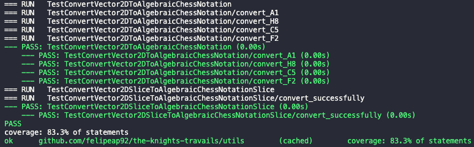

# The Knight’s Travails


This is a small program that uses the [Breadth-First Search (BFS)](https://en.wikipedia.org/wiki/Breadth-first_search) algorithm to solve The Knight’s Travails problem, where you have to find the shortest sequence of moves for a Knight between the starting and target positions. 

## Dependencies

- **[Go 1.16](https://golang.org/)**
- **[Cobra](https://github.com/spf13/cobra)**
- **[gotest](https://github.com/rakyll/gotest)**

## Run

1. Clone this repo
2. Run `go run main.go find {startPos} {targetPos}`

ps: Both start and target positions should be in capital [Algebraic Chess Notation](https://en.wikipedia.org/wiki/Algebraic_notation_(chess)).

Example:
```bash
> go run main.go find A8 B7
C7 E8 D6 B7
```

## Run Test

1. To run all the tests just execue `make test`



## License

This project is licensed under the Apache 2.0 License - see the [LICENSE](LICENSE) file for details.